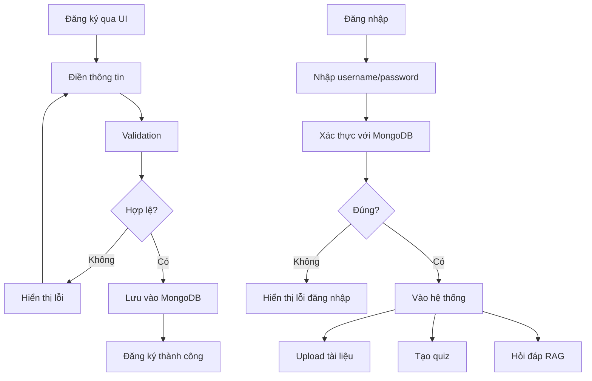

# 📝 Hướng dẫn Đăng ký & Đăng nhập

## 🎯 Tổng quan

Hệ thống hỗ trợ 2 phương thức:
1. **Đăng ký tài khoản mới** qua UI
2. **Đăng nhập** với tài khoản đã tạo

---

## 📋 Yêu cầu

- Tài khoản MongoDB Atlas đã cấu hình
- Python environment: `conda activate agent_for_teacher`

---

## 🔐 Cách 1: Đăng ký qua UI (Khuyến nghị)

### Bước 1: Chạy UI đăng ký

```bash
# Kích hoạt environment
conda activate agent_for_teacher

# Chạy UI đăng ký
python scripts/register_ui.py
```

Hoặc:

```bash
python ui/app.py register
```

### Bước 2: Điền thông tin

- **Tên đăng nhập*** (bắt buộc): Ít nhất 3 ký tự
- **Email** (tùy chọn): email@example.com
- **Họ và tên** (tùy chọn): Nguyễn Văn A
- **Mật khẩu*** (bắt buộc): Ít nhất 6 ký tự
- **Xác nhận mật khẩu*** (bắt buộc): Nhập lại mật khẩu

### Bước 3: Nhấn "Đăng ký"

✅ Thành công → Tài khoản được tạo trong MongoDB
❌ Lỗi → Kiểm tra thông báo lỗi

---

## 🔐 Cách 2: Đăng ký qua Script

### Script nhanh:

```bash
conda activate agent_for_teacher

# Tạo user với thông tin cơ bản
python scripts/create_user.py --username teacher1 --password teacher123

# Tạo user với đầy đủ thông tin
python scripts/create_user.py \
    --username teacher1 \
    --password teacher123 \
    --email teacher1@school.edu.vn \
    --full_name "Nguyễn Văn A"
```

---

## 🚀 Đăng nhập vào hệ thống

### Bước 1: Chạy ứng dụng chính

```bash
conda activate agent_for_teacher
python ui/app.py
```

### Bước 2: Nhập thông tin đăng nhập

- **Username**: teacher1 (hoặc tên bạn đã đăng ký)
- **Password**: teacher123 (hoặc mật khẩu bạn đã đặt)

### Bước 3: Bắt đầu sử dụng

✅ Đăng nhập thành công → Sử dụng tất cả tính năng

---

## 📊 Kiểm tra tài khoản trong Database

```bash
# Xem danh sách users
python scripts/view_atlas_data.py

# Kiểm tra kết nối
python scripts/check_atlas_connection.py
```

---

## 🔒 Bảo mật

### Hiện tại:
- Password lưu dạng **plain text** (không mã hóa)
- ⚠️ **Chỉ dùng cho môi trường phát triển/demo**

### Cải thiện trong tương lai:
```python
# TODO: Thêm bcrypt để hash password
import bcrypt

# Hash password trước khi lưu
hashed_password = bcrypt.hashpw(password.encode('utf-8'), bcrypt.gensalt())

# Verify password khi đăng nhập
bcrypt.checkpw(input_password.encode('utf-8'), hashed_password)
```

---

## 💡 Tài khoản mặc định

### Demo account (đã tạo sẵn):
- **Username**: demo
- **Password**: demo123

### Admin fallback (chỉ khi DB lỗi):
- **Username**: admin
- **Password**: admin

---

## ❓ Troubleshooting

### Lỗi: "Username hoặc email đã tồn tại"
→ Thử username/email khác

### Lỗi: "Hệ thống không khả dụng"
→ Kiểm tra kết nối MongoDB:
```bash
python scripts/check_atlas_connection.py
```

### Lỗi: "Password phải có ít nhất 6 ký tự"
→ Đặt password dài hơn

### Không thể đăng nhập
→ Kiểm tra username/password chính xác
→ Xem logs trong terminal

---

## 📝 Database Schema

### Collection: `users`

```json
{
  "_id": ObjectId("..."),
  "username": "teacher1",
  "password": "teacher123",
  "email": "teacher1@school.edu.vn",
  "full_name": "Nguyễn Văn A",
  "created_at": "2025-10-23T10:30:00",
  "updated_at": "2025-10-23T10:30:00"
}
```

---

## 🎓 Ví dụ sử dụng

### Đăng ký tài khoản giảng viên:

```bash
python scripts/create_user.py \
    --username gv_khiem \
    --password khiem2024 \
    --email khiem@school.edu.vn \
    --full_name "Nguyễn Anh Khiêm"
```

### Đăng nhập và upload tài liệu:

1. Chạy: `python ui/app.py`
2. Đăng nhập với `gv_khiem / khiem2024`
3. Upload PDF tài liệu giảng dạy
4. Sử dụng các tính năng AI

---

## 🔄 Workflow hoàn chỉnh



---

## 📞 Hỗ trợ

Nếu gặp vấn đề, check logs trong terminal hoặc liên hệ admin.
