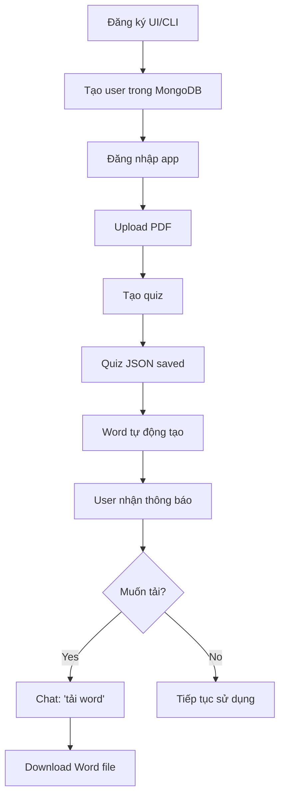

# 🎉 TÓM TẮT CÁC TÍNH NĂNG MỚI

## ✅ Đã hoàn thành

### 1. 🔐 Hệ thống Đăng ký & Đăng nhập hoàn chỉnh

#### 📁 Backend Changes:

**`services/database_service.py`:**
- ✅ Thêm method `check_user_exists()` - Kiểm tra username/email đã tồn tại
- ✅ Thêm method `create_user()` - Tạo user mới với validation
  - Username (bắt buộc, ≥3 ký tự)
  - Password (bắt buộc, ≥6 ký tự)
  - Email (tùy chọn)
  - Full name (tùy chọn)
- ✅ Cập nhật `authenticate_user()` - Xác thực user từ MongoDB

**`services/ui_integration_service.py`:**
- ✅ Thêm method `register_user()` - Wrapper cho UI gọi database service

#### 📁 Frontend Changes:

**`ui/app.py`:**
- ✅ Thêm function `register_new_user()` với validation:
  - Username ≥3 ký tự
  - Password ≥6 ký tự
  - Password confirmation match
  - Email format validation
- ✅ Tạo UI đăng ký riêng biệt (`register_demo`)
- ✅ Hỗ trợ chạy 2 modes:
  - `python ui/app.py` → Main app với authentication
  - `python ui/app.py register` → Registration UI

#### 📁 Scripts:

**`scripts/create_user.py`:**
- ✅ Script CLI để tạo user nhanh
- ✅ Hỗ trợ arguments:
  - `--username` (required)
  - `--password` (required)
  - `--email` (optional)
  - `--full_name` (optional)
- ✅ Auto-validation và verify authentication

**`scripts/register_ui.py`:**
- ✅ Script launcher cho UI đăng ký
- ✅ Shortcut: `python scripts/register_ui.py`

---

### 2. 📄 Tự động tạo Word khi tạo Quiz

#### 📁 Agent Changes:

**`services/agent/agent_service.py`:**
- ✅ Cập nhật `quiz_generation_node()`:
  - Tự động gọi `QuizToWordConverter` sau khi tạo quiz
  - Tạo file Word từ `quiz_data.json`
  - Thông báo "📄 File Word đã được tạo tự động!"
  - Vẫn giữ option "tải word" nếu cần tải lại

#### 📁 Flow mới:

```
1. User: "tạo quiz về Chapter 1"
   ↓
2. Quiz Generation Service
   → Tạo quiz_data.json
   ↓
3. QuizToWordConverter (TỰ ĐỘNG)
   → Tạo quiz_word_YYYYMMDD_HHMMSS.docx
   ↓
4. Response:
   "✅ Đã tạo 10 câu hỏi...
    📄 File Word đã được tạo tự động!
    
    Bạn có muốn tải file Word không? Nhắn 'tải word'."
```

---

## 📊 Database Schema Updates

### Collection: `users`

**Trước:**
```json
{
  "username": "demo",
  "password": "demo123"
}
```

**Sau:**
```json
{
  "username": "teacher1",
  "password": "teacher123",
  "email": "teacher1@school.edu.vn",      // NEW
  "full_name": "Nguyễn Văn A",           // NEW
  "created_at": "2025-10-23T10:30:00Z",  // NEW
  "updated_at": "2025-10-23T10:30:00Z"   // NEW
}
```

---

## 🚀 Cách sử dụng

### Đăng ký qua UI:

```bash
# Cách 1: Script launcher
python scripts/register_ui.py

# Cách 2: CLI argument
python ui/app.py register
```

### Đăng ký qua CLI:

```bash
# Cơ bản
python scripts/create_user.py --username teacher1 --password teacher123

# Đầy đủ thông tin
python scripts/create_user.py \
    --username teacher1 \
    --password teacher123 \
    --email teacher1@school.edu.vn \
    --full_name "Nguyễn Văn A"
```

### Đăng nhập:

```bash
# Chạy app
python ui/app.py

# Nhập thông tin đăng nhập
Username: teacher1
Password: teacher123
```

### Tạo Quiz với Word:

```
1. Đăng nhập vào hệ thống
2. Upload tài liệu PDF
3. Chat: "tạo quiz về Chapter 1"
4. ✅ Quiz được tạo
5. 📄 File Word tự động được tạo
6. (Optional) Chat: "tải word" để tải lại
```

---

## 🎯 Workflow hoàn chỉnh



---

## 📝 Validation Rules

### Username:
- ✅ Bắt buộc
- ✅ ≥3 ký tự
- ✅ Unique (không trùng với user khác)

### Password:
- ✅ Bắt buộc
- ✅ ≥6 ký tự
- ✅ Confirmation match (trong UI)

### Email:
- ⚠️ Tùy chọn
- ✅ Format validation (có @)
- ✅ Unique (nếu có)

### Full Name:
- ⚠️ Tùy chọn
- ✅ Không validation

---

## 🔒 Security Notes

### ⚠️ Hiện tại (Development):
- Password lưu **plain text** (không mã hóa)
- Phù hợp cho môi trường demo/test

### 🔐 TODO Production:
```python
# Cần thêm bcrypt để hash password
import bcrypt

# Khi tạo user
hashed_pw = bcrypt.hashpw(password.encode(), bcrypt.gensalt())

# Khi authenticate
bcrypt.checkpw(input_pw.encode(), stored_hashed_pw)
```

---

## 📚 Documentation

- **Full guide:** `docs/AUTHENTICATION.md`
- **Troubleshooting:** Check terminal logs
- **Database check:** `python scripts/view_atlas_data.py`

---

## ✅ Testing Checklist

### Đăng ký:
- [ ] Đăng ký qua UI với thông tin đầy đủ
- [ ] Đăng ký qua CLI với thông tin cơ bản
- [ ] Kiểm tra validation (username ngắn, password ngắn, email sai format)
- [ ] Kiểm tra duplicate username/email
- [ ] Verify user trong MongoDB

### Đăng nhập:
- [ ] Đăng nhập với user mới tạo
- [ ] Đăng nhập với username/password sai
- [ ] Session tracking hoạt động
- [ ] Upload document với user mới

### Quiz + Word:
- [ ] Tạo quiz → kiểm tra JSON saved
- [ ] Kiểm tra Word file tự động tạo
- [ ] Kiểm tra nội dung Word (format, questions, answers)
- [ ] Chat "tải word" → download file
- [ ] Kiểm tra cleanup khi session end

---

## 🎉 Kết quả

### ✅ User có thể:
1. Đăng ký tài khoản riêng (không dùng demo nữa)
2. Lưu email và tên đầy đủ
3. Tạo quiz và tự động có file Word
4. Tải lại Word bất cứ lúc nào

### 🚀 Improvement đã đạt:
- Hệ thống authentication hoàn chỉnh
- User management chuẩn
- Workflow tạo quiz mượt mà hơn
- UX tốt hơn (auto-create Word)
